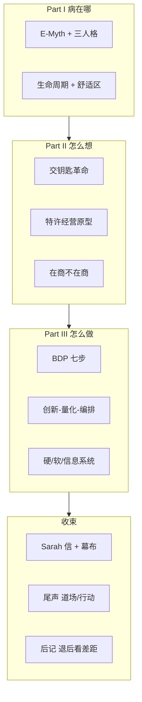

# The E-Myth Revisited — 全书总结

> 阅读完成：2026-06-13 · 笔记 01–23（Foreword → Afterword）

## 一句话

**懂技术 ≠ 会经营企业。**
小企业要活下来、活得像样，必须把店当成 **可设计、可复制、可交钥匙的原型** 来建——**在商不在商**，用 **系统** 跑生意，用 **人生首要目标** 定方向，用 **关怀与游戏** 聚人，用 **营销** 在顾客心里占位；否则只是把 **自己的混乱** 带进店里，造出 **世上最糟的工作**。

---

## 一、问题从哪来

### 创业神话（E-Myth）

文化把创业浪漫化成「英雄开店」——实际上，多数老板 **创过业**，但 **企业家只闪现了一瞬间**，之后被 **致命假设** 绑架：

> **「我懂这门手艺，就懂这门生意。」**

### 三种人格（每人身上都有，需平衡）

| 人格             | 驱动             | 陷阱                       |
| ---------------- | ---------------- | -------------------------- |
| **企业家** | 愿景、变、机会   | 不落地                     |
| **经理**   | 秩序、计划、现状 | 僵化                       |
| **技工**   | 「亲手做」       | 把企业当上班处，自己成瓶颈 |

### 生命周期

婴儿期（一人扛）→ 青春期（乱招人、甩手授权）→ 要么崩溃，要么走向 **成熟**：用 **企业家视角** 把企业当 **产品** 来设计，而非当 **自我延伸**。

### Sarah 线 = 全书镜子

擅长烤派 → 开店 → 凌晨两点、负债、恨派。问题不是 **不够努力**，是 **在做错误的事**——用技工方式经营，压抑了企业家与经理。

---

## 二、解法总框架

### 交钥匙革命 + 特许经营原型

学 McDonald's / FedEx：**真产品不是汉堡，是「这套系统本身」**。原型须 **系统依赖、非明星依赖**——

> **系统跑企业，人跑系统。**

### 在商，不在商

- **企业不是你的生命**；企业存在是为了 **服务你的人生**。
- 核心问题：**没有我，它还能运转吗？**

### 商业发展过程三环（持续运转，非一次性）

| 环                               | 含义                                             |
| -------------------------------- | ------------------------------------------------ |
| **创新（Innovation）**     | 改**怎么做**，尤其化解「人的问题」         |
| **量化（Quantification）** | 一切可测——否则不知好坏                         |
| **编排（Orchestration）**  | 同一做法、同一结果；**未编排的不算你拥有** |

### 特许经营游戏六条（Ch9 思维实验）

1. 一致且超预期的 **感知价值**
2. **最低必要技能** + 专家 **系统**（非雇专家）
3. **无可挑剔的秩序**
4. 一切写入 **操作手册**
5. **可预测** 的服务（每次一样）
6. 统一的 **包装**（颜色、着装、设施）

---

## 三、商业发展计划（BDP）七步

从 **人生** 到 **系统**，自上而下、**完全相互依存**；**特许经营原型 = 七步整合体**。

```
首要目标 → 战略目标 → 组织 → 管理 → 人员 → 营销 → 系统
     ↑___________________________________|
```

| 步                   | 核心问题         | 要点                                                                             |
| -------------------- | ---------------- | -------------------------------------------------------------------------------- |
| **1 首要目标** | 人生要什么？     | 先于企业；葬礼磁带、幕布/舒适区；企业**服务** 人生脚本                     |
| **2 战略目标** | 企业须达成什么？ | 金钱标准、值得追的机会；**商品 vs 产品**；建好是为了 **将来卖掉**    |
| **3 组织战略** | 谁对谁负责？     | **完成态** 架构图 + **岗位契约**；手册先于招聘；从底层原型化         |
| **4 管理战略** | 如何管？         | **管理系统**，非明星经理；Venetia「有人听见我」；清单 + OM                 |
| **5 人员战略** | 如何让人做事？   | **不能命令，只能让人买入游戏**；工作映照内在；企业 = 道场                  |
| **6 营销战略** | 顾客为何选你？   | 营销**始于止于顾客**；购买 **非理性、瞬间**；**整流程 = 营销** |
| **7 系统战略** | 如何粘合？       | **硬 / 软 / 信息** 三类系统；一切 **相互依存**                       |

**Sarah 的「它（It）」= 关怀** —— 接电话、出炉、收钱，每一步都在表达关怀。

---

## 四、商品 vs 产品（全书关键区分）

| 概念                        | 中文理解                   | 例子                                 |
| --------------------------- | -------------------------- | ------------------------------------ |
| **商品（commodity）** | 顾客手里真正拿走的东西     | 电脑、派、香水                       |
| **产品（product）**   | 顾客离开时的**感受** | 希望、秩序感、控制感、**关怀** |

> Revlon：工厂造化妆品，店里卖 **希望**。

营销要找的是 **被感知的需求**——顾客觉得不需要 = 不需要。

---

## 五、三类系统 + 系统四层

### 三类系统

| 类型               | 是什么         | 例子                                               |
| ------------------ | -------------- | -------------------------------------------------- |
| **硬系统**   | 物、环境       | 招牌、颜色、制服、防污环                           |
| **软系统**   | 人、话术、理念 | 招聘脚本、「来过我们店吗？」、销售三基准、游戏规则 |
| **信息系统** | 衡量互动       | 销售 13 基准漏斗、派销量/时段                      |

### 系统四层（How We Do It Here 体系）

1. **我们在这里怎么做**
2. **我们在这里如何招人、培训**
3. **我们在这里如何管理**
4. **我们在这里如何变革**

### Live coding 隐喻（见 `KeyPoints.md`）

> 企业像 live coding：**岗位 = 函数**，**操作手册 = 接口契约**；换人可换，产出一致。重要的是 **职责**，不是 **不可替代的人**。

---

## 六、几个必须记住的「反直觉」

1. **卖产品，不卖商品** — 感受才是顾客买的。
2. **找被感知的需求** — 潜意识瞬间决策；「我再想想」常是借口。
3. **销售是打开，不是关闭** — 需求分析是核心，方案演示补理性。
4. **授权 ≠ 甩手** — 问责不能委派。
5. **游戏必须真** — 你先玩，员工才买入；**先游戏，后岗位**。
6. **差距 = 缺系统 + 缺专有做法** — 后记第一步：**退后一步**，看现状 vs 终态。

---

## 七、关键案例速查

| 案例                             | 说明                                       |
| -------------------------------- | ------------------------------------------ |
| **Sarah / All About Pies** | 技工陷阱 → BDP 七步 → 「让灵性自由奔跑」 |
| **Venetia 酒店**           | 火柴薄荷咖啡报纸 = 管理系统听见客户        |
| **Venetia 老板**           | 工作映照内在；企业 = 道场；理念三部分      |
| **防污环**                 | 冲突 + 意志 → 硬系统解放人                |
| **IBM 蓝 / 海军蓝西装**    | 感知即现实；人口统计 + 心理统计            |
| **权力点销售三基准**       | 预约 → 需求分析 → 方案；结构 + 实质      |

---

## 八、灵魂层（方法论之上）

BDP 若只有表格和清单，仍会空。全书后半反复回到：

- **意义来自关怀**，关怀来自 **灵性**（Ch19 给 Sarah 的信）
- **Keep the curtain up** — 幕布 = 舒适区；**舒适让众人变懦夫**
- **灵性在前方路径上**，不在怀旧里（厨房、黑马、阿姨）
- **尾声**：混沌在内不在外；小企业 = **桥梁 + 道场**
- **听 → 忘；看 → 记；做 → 懂** —— **该行动了**

---

## 九、全书结构



---

## 十、读完后可立刻做的三件事

1. **写首要目标** — 企业五年后必须为你的人生贡献什么？（不是营收口号）
2. **画差距** — 今天 vs 终态；差距里缺哪类 **系统 / 手册 / 脚本**？
3. **选一个软系统试点** — 接待第一句话、销售开场、关店 checklist；跑一轮 **创新 → 量化 → 编排**

---

## 十一、章节索引

| 文件   | 内容                                        |
| ------ | ------------------------------------------- |
| 01–02 | Foreword、Introduction                      |
| 03–08 | Part I：Ch1–6（E-Myth、三人格、生命周期）  |
| 09–11 | Part II：Ch7–9（交钥匙、原型、在商不在商） |
| 12–13 | Ch10–11（BDP 三环、七步总览）              |
| 14–20 | Ch12–18（七步展开）                        |
| 21     | Ch19 给 Sarah 的信                          |
| 22–23 | Epilogue、Afterword                         |
| —      | `KeyPoints.md` 个人高光 · `Summary.md` 全书总结 |

---

## Bottom line

《The E-Myth Revisited》不是「小企业成功学」，而是一套 **把企业工程化、同时保留人性与关怀** 的完整语言。Sarah 从「恨烤派」到「开关怀学校」——那就是 **技工 → 原型设计者** 的变形；**在商不在商**，**系统即解法**，**关怀即产品**。
