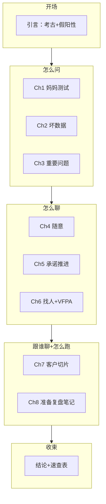

# The Mom Test — 全书总结

> 阅读完成：2026-06-14 · 笔记 01–10（Introduction → Conclusion）

## 一句话

**客户对话不是求认可，是挖真相。**
用 **妈妈测试** 问过去、问生活、少说多听；挡 **恭维/空话/点子** 三种坏数据；问 **能推翻你** 的重要问题；保持 **随意**、推 **承诺与推进**；先 **切片** 再放量；用 **准备/复盘/笔记** 跑流程——否则 **聊错比不聊更糟**，假阳性会烧光钱和时间。

---

## 一、问题从哪来

### 考古现场隐喻

从客户处学习像 **发掘考古遗址**：

- 推土机式问题（「你觉得这主意好吗？」）→ 逼人说好话，真相碎掉
- 牙刷式挖掘 → 不敢挖深，不知道有没有宝

> **真相是目标，问题是工具** —— 每个问题都可能带偏对方，让整场对话白费。

### 假阳性比无用更危险

作者第一家公司 Habit：**三年全职聊客户，聊法错了 = 白聊**。

| 后果 | 说明 |
|------|------|
| 无用 | 浪费时间 |
| **假阳性** | 以为路对了 → 过度投入钱、时间、团队 |
| 客户在撒谎 | 即便你没搞砸，他们也会误导你（爱、礼貌、乐观） |

**客户对话（customer conversations）≠ 客户开发全书** —— 本书只讲 **怎么聊** 这一块实操。

---

## 二、妈妈测试（全书核心）

### 三规则

1. **谈他们的生活，不谈你的想法**
2. **问过去具体事实，不问泛泛或对未来的看法**
3. **少说多听**

做对了，对方甚至不知道你有想法；连妈妈都骗不了你。

### iPad 食谱：同一产品，两种命运

| 失败版 | 通过版 |
|--------|--------|
| 暴露自我、推销假想产品 | 从头到尾没谈你的想法 |
| 礼貌恭维、非真实购买情境里合理化价格 | 问 iPad 上 **上次** 做了什么、食谱从哪来 |
| 辞职砸钱 → 没人买（包括妈妈） | 得到细分、渠道、待验证风险 |

> **大错几乎总是提想法太早，而非太晚。**  
> **不提想法** = 客户对话 **最容易、收益最大** 的改进。

### 好问题 vs 坏问题（速记）

| 坏 | 好 |
|----|-----|
| 「这主意好吗？」「你会买吗？」 | 「上次发生那次讲讲」「现在怎么应付？」 |
| 「愿意付多少？」（假想未来） | 「现在花多少钱？」「钱从哪来？」 |
| 只听功能愿望 | 「你何必多此一举？」「那有什么后果？」 |

**经验法则：** 意见毫无价值；涉及未来 = 过度乐观谎言；人知问题，不知解法；不懂目标 = 盲射。

**每场结尾：**「我还该跟谁聊？」「我还该问什么？」

---

## 三、三种坏数据与三招

就算遵守妈妈测试，仍会跑偏 —— 兴奋时 pitch、为解释不得不谈想法、陷在假想未来里。

| 坏数据 | 形态 | 应对 |
|--------|------|------|
| **恭维** | 「好酷」「喜欢」 | **挡开**，继续挖事实 |
| **空话** | 「通常」「我会」「可能会」 | **锚定** 到最近一次具体 |
| **点子** | 对方给你的功能建议 | **挖透** 动机与约束，不当需求清单 |

> **恭维是客户调研的 fool's gold** —— 闪亮、分心、完全无价值。

**悲情问题（Pathos）：**「我辞职做的秘密项目…请诚实！」→ 暴露自我，邀请谎言。

---

## 四、问重要的问题

会妈妈测试后，别问 **不偏见但无用** 的问题（白转圈）。

**思想实验：**

- 公司 **已经失败** —— 为什么？
- **巨大成功** —— 必须为真的条件是什么？

**判定：** 答案能 **完全改变或推翻** 生意构想 = 重要问题。意外答案却不改你在做的事 → 问题本来就不重要。

> **每场对话至少一问让你怕** —— 可以问钱，你是创业公司。

### 爱坏消息

| 情境 | 坏消息意味 |
|------|------------|
| 5 万预算，花 5 千发现死胡同 | 太棒了，剩下 4 万 5 找活路 |
| 聊几人根本不在乎 | 省下开发推广的时间金钱 |

**最有信息量的回应之一：**「嗯……我不太确定」—— **温吞（meh）> 狂热（wow）**。

**过早变焦：** 先广角摸清问题与细分，再亮方案 —— 否则假验证。

**市场风险 vs 产品风险：** 对话擅长前者；后者要靠原型与承诺验证。

---

## 五、怎么聊：随意 + 承诺

### 保持随意（Ch4）

Blank 式三次正式会面 **难约、低效**（1 小时会 ≈ 4 小时总成本）。

**结构上** 仍分：问题 → 方案 → 销售；**第一次不必是 meeting**。

| 正式会面反模式 | 随意聊 |
|----------------|--------|
| 日历块、通勤、铺垫 | 会议上直接问最重要一问 |
| 期待你展示产品 | 对方不知道在聊你的点子 |
| 「改天去另一家咖啡馆？」 | **第一次约会已经开始了** |

### 承诺与推进（Ch5）

摸清事实后再变焦亮想法 → 恭维回来 → 用 **承诺** 戳穿假阳性。

| 概念 | 含义 |
|------|------|
| **承诺** | 付出时间、声誉、金钱 |
| **推进** | 漏斗下一步，更接近成交 |

**僵尸线索：** 一直见面、说好听的、从不支票 —— 创业被 friend-zone。

> **会议只有成功或失败，没有「开得还行」。**

**早期传道者：** 愿为人生最糟部分付钱的人 —— 情绪 + 预算信号。

---

## 六、找谁聊、怎么约

### 冷启动目标 = 消灭冷启动

100 冷触 98 拒？ **2 场在进行就够** —— 尽快变 **暖介绍** 雪球。

| 去找他们 | 让他们来找你 |
|----------|--------------|
| 抓住偶然、好借口、沉浸他们的场 | 办聚会、演讲教学、行业博客、耍聪明换信用 |
| 落地页收邮箱 + **给人发邮件聊** | Buffer 经典：对话比转化率重要 |

**顾问心态：** 别 needy 找客户 —— 找 **行业顾问**；你在评估他们，反而控场。

**聊到听不到新信息为止**；细分聚焦时 **3–5 场** 可能够；10+ 场仍散乱 → 细分太模糊。

### VFPA 正式约见框架

| 要素 | 内容 |
|------|------|
| **Vision** | 半句话愿景 —— **不提想法** |
| **Framing** | 阶段 + 暂无东西可卖 |
| **Weakness** | 卡在哪，给对方帮忙机会 |
| **Pedestal** | 为何尤其他们能帮 |
| **Ask** | 约时间聊 |

口诀：**Very Few Wizards Properly Ask**

---

## 七、选择客户（别淹死）

创业 **不是饿死，是淹死** —— 选项、线索、点子太多。

> **服务所有人之前，必须先服务某一个人。**

Google / PayPal / Evernote 起步都 **极窄**。

**客户切片（who-where）：** 谁最可能买 + 去哪找，直到 **能触达**。

调味粉案例：用途无限 → 切片为 **健康食品店里的幼儿妈妈** → 先要 **货架位承诺** 再推进。

**多利益相关方：** 购买链上每一环都可能让你死 —— 分别切片、分别聊。

---

## 八、运行流程（Ch8）

对话技术都对， **流程不对仍会得到坏结果**。

### 学习瓶颈

「你管产品，我去学」→ 客户话卡一人脑子里 = **事实独裁**。

**三件套：** 准备 · 复盘 · 好笔记

### 会前一句（最重要）

> **「我们想从这些人身上学到什么？」**

团队对齐 **三大学习目标**；能桌面研究的先做；写对方在乎什么的猜测（一小时 prep 别拖）。

### 谁该到场

**最佳两人：** 一说一记；第二人可打断烂问题。创始人 **不能外包学习** —— 坏消息须亲耳消化。

### 笔记符号（示例）

| 符号 | 含义 |
|------|------|
| ☇ | 痛点 |
| ☐ / ⤴ | 障碍 / 变通 |
| ＄ | 钱/预算 |
| ☆ | 待跟进 |

索引卡复盘：痛点不成立 → **抽出所有闪电符卡** 换已验证问题。

### 一批对话全流程

**前：** 细分 → 三大问题 → 找谁 → 猜测 → 桌面研究  
**中：** VFPA · 随意 · 妈妈测试 · 挡/锚/挖 · 笔记 · 推承诺  
**后：** 团队过引语 → 永久存储 → 更新信念 → **下一组三大问题**

### 好会的结果

| 产出 | 含义 |
|------|------|
| **事实** | 他们做什么、为何做 —— 非恭维/空话/意见 |
| **承诺** | 付出时间/声誉/金钱 |
| **推进** | 漏斗下一步 |

---

## 九、收尾：会好起来 + 砍绳结

作者仍会滑入 pitch —— **注意到就有机会修**；跟团队复盘，别苛责。

私教案例：众人 geek 验证「警察客户」计划时，他 **直接打电话** —— 20 分钟约到试课。

> **有流程有价值，但别卡死在流程里** —— 有时拿起电话就砍过去。

---

## 十、几个必须记住的「反直觉」

1. **聊错比不聊更糟** —— 假阳性烧资源。
2. **不提想法** —— 最大单项改进。
3. **意见毫无价值** —— 要事实与承诺。
4. **温吞 > 狂热** —— meh 才是真信号。
5. **会议没有「还行」** —— 成功或失败。
6. **僵尸线索是 friend-zone** —— 必须推承诺或明确拒绝。
7. **学习不能外包** —— 创始人须在场合传播。
8. **流程卡住时** —— 问能不能直接验证。

---

## 十一、关键案例速查

| 案例 | 说明 |
|------|------|
| **Habit 三年** | 聊法全错 = 白聊 |
| **iPad 食谱两次对话** | pitch 失败 vs 生活问题成功 |
| **消息工具→Dropbox** | 「你何必 bother」挖到真需求 |
| **MTV 报表** | 客户要邮件非 dashboard |
| **没见律师亏 50 万** | 回避重要问题 |
| **办公室经理啤酒** | 随意聊发现真痛点是讨债 |
| **投资人便利贴墙** | 5 分钟证伪 |
| **三脚架原型被买** | 最强承诺 |
| **调味粉健康店** | 切片 + 货架承诺 |
| **学生漏勺** | 20 种客户混聊信号混乱 |
| **私教打警察** | 砍绳结，别卡流程 |

---

## 十二、全书结构

---

## 十三、读完后可立刻做的三件事

1. **写下三大问题** ——「若公司会死，最可能死于什么？」转成本场必问。
2. **审计最近三场会** —— 有没有恭维收场、无笔记、无团队复盘、无承诺？
3. **切一个 who-where 切片** —— 能触达、能约到、能要到小承诺（时间/介绍/货架/定金）。

---

## 十四、章节索引

| 文件 | 内容 |
|------|------|
| 01 | Introduction — 考古隐喻、假阳性、Habit |
| 02 | Ch1 — 妈妈测试三规则、好/坏问题 |
| 03 | Ch2 — 恭维/空话/点子，挡/锚/挖 |
| 04 | Ch3 — 重要问题、爱坏消息、过早变焦 |
| 05 | Ch4 — 保持随意、会议反模式 |
| 06 | Ch5 — 承诺、推进、僵尸线索 |
| 07 | Ch6 — 冷启动、VFPA、顾问心态 |
| 08 | Ch7 — 客户切片 who-where |
| 09 | Ch8 — 瓶颈、prep/review、笔记、流程清单 |
| 10 | Conclusion — 速查表、砍绳结 |
| — | `KeyPoints.md` 个人高光 · `Summary.md` 全书总结 |

---

## Bottom line

《The Mom Test》不是销售话术集，而是一套 **把客户对话从「讨认可」改成「挖真相」** 的纪律：问过去、挡坏数据、怕重要问题、随意开场、硬推承诺、窄切片、团队跑流程。聊对了，你甚至不必说服对方你喜欢你的主意 —— **市场会用事实、承诺和推进告诉你答案**。
